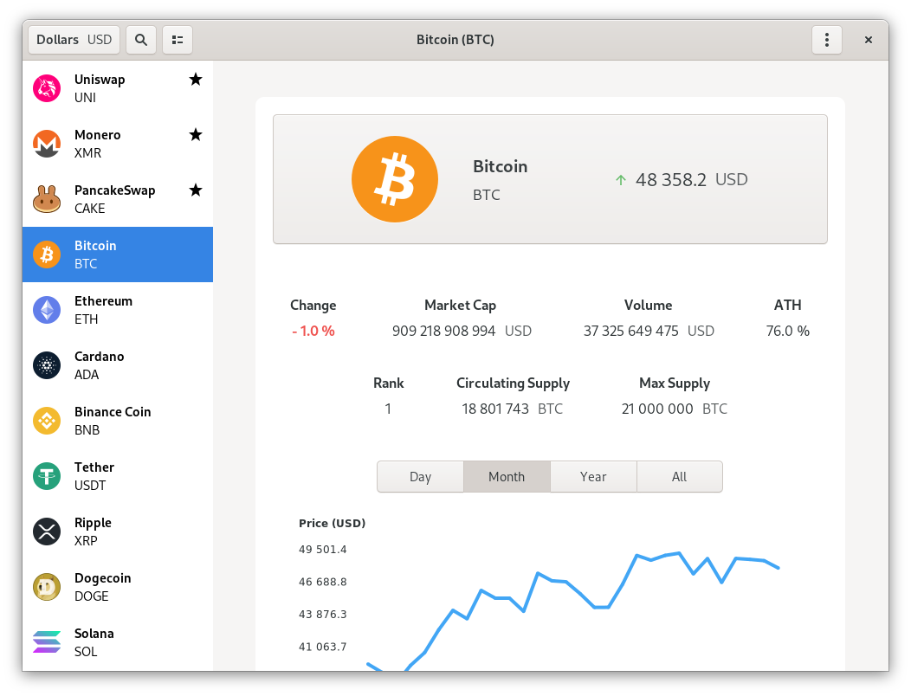

# Digital Assets

Prices, statistics and informations about Digital Assets.

Thanks to Nomics (https://nomics.com) for their free API.

**Donations BTC: bc1qejj6y2gvya5rrun4sfsl08qdeyv36ndhm0ml85**



## AUTHOR

Created in 2019 by François Grabenstaetter <francoisgrabenstaetter@gmail.com>

## LICENSE

This program is distributed under the GNU GPL 3.0 License.

For more informations: https://www.gnu.org/licenses/gpl-3.0.en.html

## INSTALL AND RUN

```bash
	mkdir build && cd build
	sudo meson .. --prefix=/usr
	sudo ninja install
	fr.fgrabenstaetter.DigitalAssets
```
