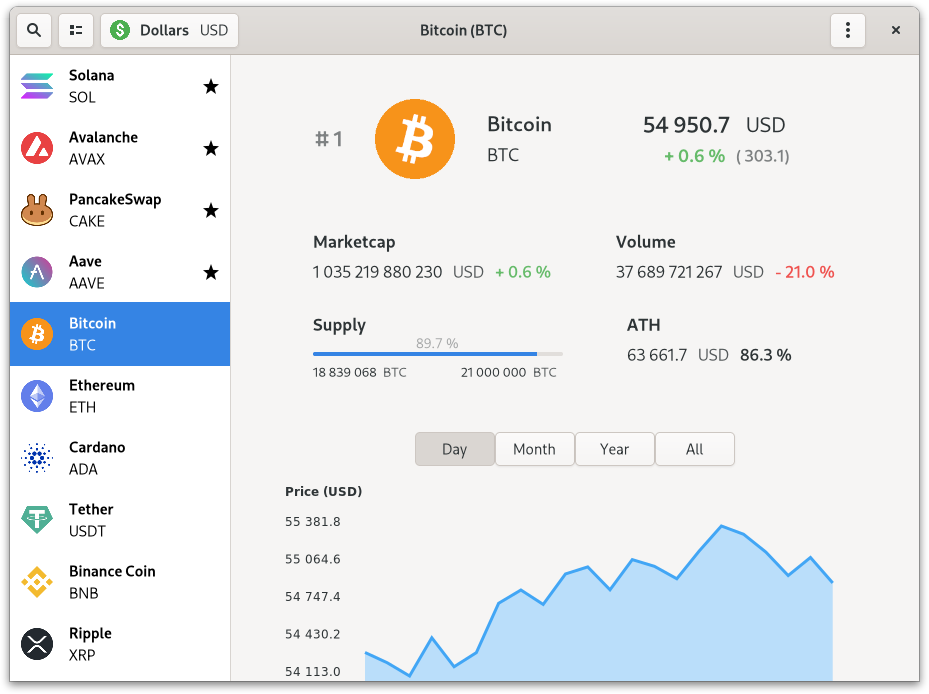

# Digital Assets

Cryptocurrencies prices and statistics.

Crypto market cap & pricing data provided by Nomics (https://nomics.com)

**Donations BTC: bc1q4vupl5zwxctn7lwacqdqp4u07gfwj2jsy7ums0**

**Donations ETH: 0xE7F52826f22B0F48BD045b4f9B61a219A64cb5f8**



## Author

Created in 2019 by François Grabenstaetter <francoisgrabenstaetter@gmail.com>

## License

This program is distributed under the GNU GPL 3.0 License.

For more informations: https://www.gnu.org/licenses/gpl-3.0.en.html

## Install and run

### From Flathub

A Flatpak version is available here: https://flathub.org/apps/details/fr.fgrabenstaetter.DigitalAssets

```bash
	flatpak install flathub fr.fgrabenstaetter.DigitalAssets
	flatpak run fr.fgrabenstaetter.DigitalAssets
```

### From source

```bash
	mkdir build && cd build
	meson .. --prefix=/usr/local
	sudo ninja install
	/usr/local/bin/digital-assets
```
